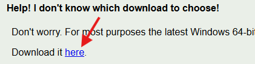
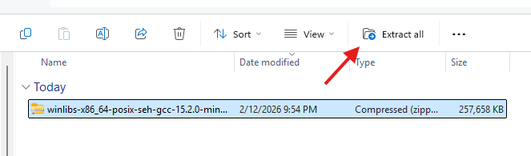
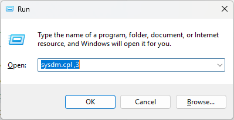
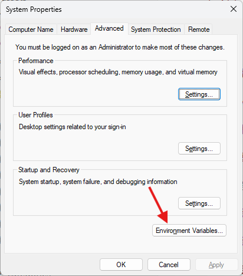
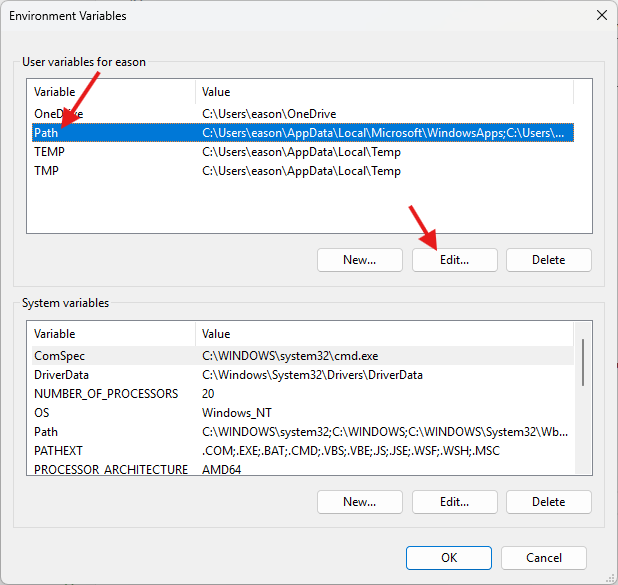
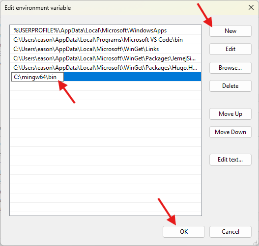
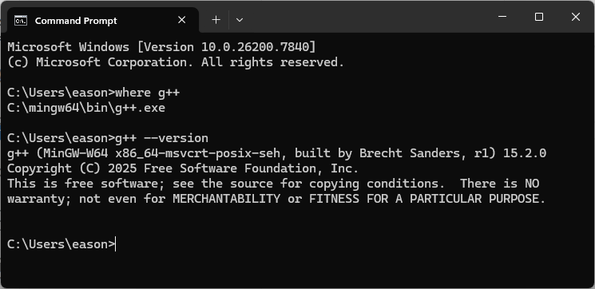

## 下載檔案

前往 [WinLibs](https://winlibs.com/#download-release) 網站，下載檔案。



## 解壓縮檔案

將檔案解壓縮至 `C:\` 中。




## 設定環境變數 PATH

按下 `Win + R` ，開啟執行視窗，輸入

```cmd
sysdm.cpl ,3
```

並按下 Enter。







複製

```cmd
C:\mingw64\bin
```



## 完成


